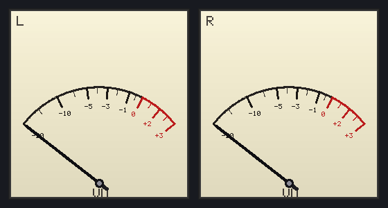

# 🎚️ MP3 Player + VU / LED meter (C/C++ → WASM)

[日本語](README.md) | **English**

A browser MP3 player where **decoding**, **level metering**, and **meter drawing** are all done in **pure C/C++** compiled to WebAssembly.
JavaScript only handles what the browser requires: file selection, Web Audio playback, and blitting to a canvas.

Two level displays, switchable with a button:

- **VU meter** — analog needle, arc scale and red zone drawn by C++ every frame. RMS + VU-style needle ballistics, with **peak hold** and a **clip LED**.
- **LED spectrum** — a hand-written FFT splits the signal into log-spaced bands shown as green/yellow/red LED columns, each with a **floating peak dot**.

## 🎮 Live demo

[▶ Open the demo](https://yomei-o.github.io/mp3vu/)

Open an MP3 (or drag & drop) → play → toggle **VU ⇄ LED** with the button.
**Everything runs locally** — the file is never uploaded anywhere.

<p>
  
</p>

*Screenshot shows VU mode (dual L / R meters)*

## 💡 How it works

```
MP3 file ─▶ [C/C++ WASM] decode with minimp3 ─▶ float PCM
                    │
                    ├─▶ Web Audio (JS) ────────────▶ 🔊 playback
                    │
                    └─▶ [C/C++ WASM] level calc + meter drawing
                            VU : RMS → dB → needle ballistics (+peak/clip)
                            LED: FFT → log bands → LED columns (+peak dots)
                          → RGBA buffer ─▶ (JS) blit to canvas
```

- **Decoding**: `minimp3` (public domain). `mp3dec_load_buf` expands the whole file to float PCM.
- **VU level**: RMS over the last 50 ms is converted to dB and `-45..0 dBFS` is normalised to `0..1`. A **fast-attack / slow-release** ballistic smooths the needle. The peak marker holds for a moment then falls slowly; reaching the red zone (≥ 0 VU) lights the clip LED.
- **LED spectrum**: a 2048-point hand-written radix-2 FFT (no dependencies). Hann window → 40 Hz–16 kHz collapsed into 20 log-spaced bands → converted to dB → mapped to lit LED segments. A gentle high-frequency tilt is added so treble stays visible.
- **Drawing**: needle, arc, ticks and LEDs are all rendered by C++ writing pixels straight into an RGBA framebuffer (including a hand-made 5×7 font).

## 🛠 Building the WASM

Requires [Emscripten](https://emscripten.org/).

```bash
# Point EMSDK at your install (default: /c/prog/emsdk/emsdk)
EMSDK=/path/to/emsdk ./build_wasm_mp3.sh
```

This produces `wasmdist/` (`mp3.js` + `mp3.wasm` + `index.html`). Drop it on any static host (serve over HTTP, not `file://`).

## 📁 Layout

| File | Role |
|------|------|
| `wasm_mp3.cpp` | Core: decode call, VU/LED level calc, meter drawing (C++) |
| `minimp3.h` / `minimp3_ex.h` | MP3 decoder (public domain, [lieff/minimp3](https://github.com/lieff/minimp3)) |
| `build_wasm_mp3.sh` | Emscripten build script |
| `wasmdist/` | Prebuilt demo bundle (`mp3.js` / `mp3.wasm` / `index.html`) |
| `vu_*.png` | Screenshots |

## 📝 License / note

- The core code is original.
- `minimp3` is public domain (CC0). See the header files for details.
